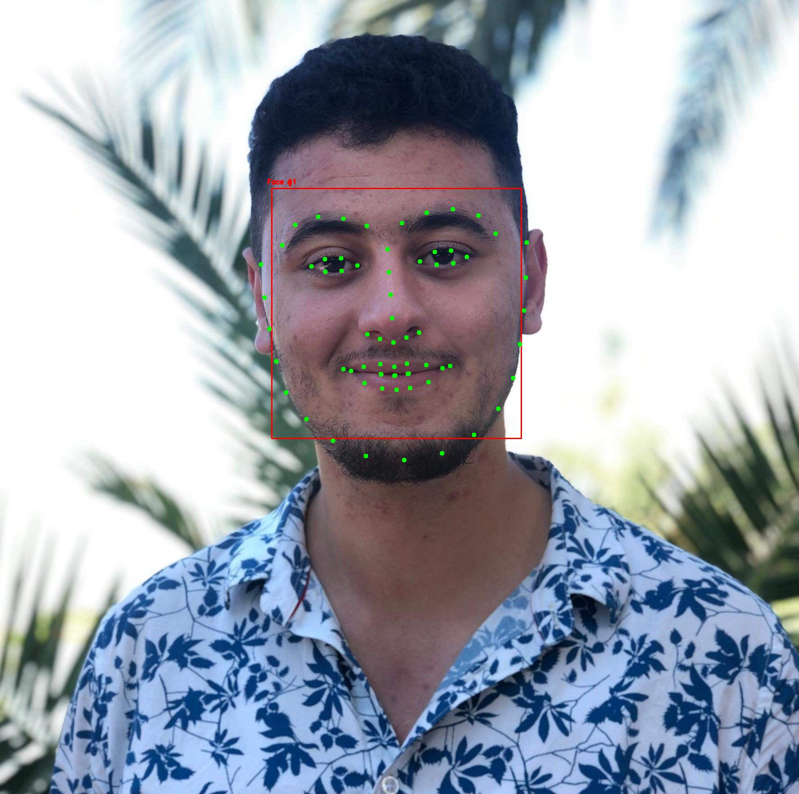
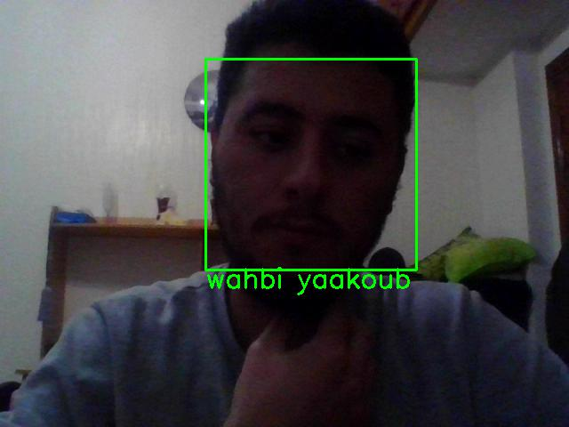

# 1. What's Face Recognition ?
Facial recognition is a way of identifying or confirming an individual’s identity using their face. Facial recognition 
systems can be used to identify people in photos, videos, or in real-time.

Facial recognition is a category of biometric security. Other forms of biometric software include voice recognition, 
fingerprint recognition, and eye retina or iris recognition. The technology is mostly used for security and law 
enforcement, though there is increasing interest in other areas of use.

# 2. Face Recognition Project Steps :
- Step 1: Face detection
- Step 2: Face analysis
- Step 3: Converting the image to data
- Step 4: Finding a match

# 3. Packages used in this Project :
- numpy
- tensoflow
- cmake
- opencv
- dlib
- scipy
- imutil

# 4. Result

### Landmark detection :

### Final Result

**Important !**: you need to download `vgg-face.mat` and `shape_predictor_68_face_landmarks.dat` to execute this project
